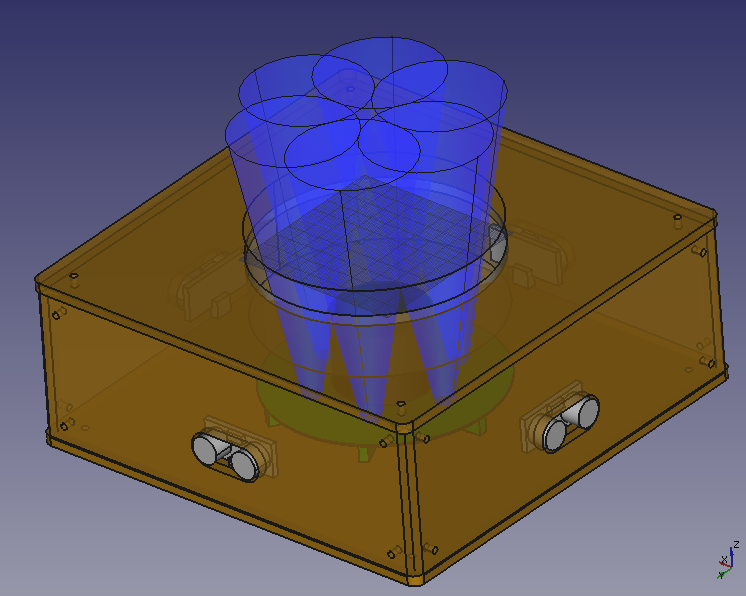

Synchrony
=========
Experiements in interactive installations around the topic of synchrony,
how peoples behavior tend to syncronize, and its effect on perception &
communication.

Prepared for a workshop at [Do It Anyway festival]
(http://www.opensourcingfestivals.eu/events/do-it-anyway-festival-sheffield-uk).
[Notes here](./doc/doitanywayfestival.md)

Conceptual references
--------------------

Saying: ["on the same wavelength"](http://www.urbandictionary.com/define.php?term=on+the+same+wavelength)

[Heart beats syncronize in romantic couples](http://www.futurity.org/heart-beats-sync-up-in-romantic-couples)

[The Effects of Synchrony on Conformity](https://www.psychologytoday.com/blog/ulterior-motives/201501/the-effects-synchrony-conformity)
watching others move in sync can cause distancing

[Syncronizity in Child development:](http://www.ask.com/world-view/synchrony-child-development-21ed4a3957d1899b)
split-second reactions between facial expressions and emotions

[Synchrony: All Together Now](https://www.psychologytoday.com/articles/200609/synchrony-all-together-now)
two people sitting opposite each other atop tables
automatically synchronized (or perfectly alternated) their swinging legs.
When asked to move to their own distinct beat, subjects found the task strenuous

[If they move in sync, they must feel in sync](http://www.academia.edu/342927/If_They_Move_in_Sync_They_Must_Feel_in_Sync_Movement_Synchrony_Leads_to_Attributions_of_Rapport_and_Entitativity)
Peoples’movement rhythms can synchronize unintentionally,
for example when walkingside by side, or intentionally, as when military units march.
The tendency to syn-chronize movement rhythms has been theorized to
play an important role in the formation of a social unit.

[From Mind Perception to Mental Connection: Synchrony as a Mechanism for Social Understanding](http://onlinelibrary.wiley.com/doi/10.1111/j.1751-9004.2012.00450.x/abstract)
 In nature, neural synchrony yields behavioral synchrony.
Humans use behavioral synchrony to promote neural synchrony, and thus, social bonding.
This reverse-engineering of social connection is an important innovation
likely underlying this distinctively human capacity to create large-scale social coordination and cohesion.

[A student of synchrony](http://www.apa.org/gradpsych/2012/03/synchrony.aspx)
people who tap their fingers in sync with an experimenter report
liking the experimenter more than those asked to tap in a different rhythm

[In sync and in control?](http://newsroom.ucla.edu/releases/in-sync-and-in-control)
found that when men are walking in step with other men,
they think that a potential foe is smaller and less physically
formidable and less intimidating than when they’re just walking in
no particularly coordinated manner with other men.

[Is There a Dark Side To Moving in Sync?](http://www.marshall.usc.edu/news/releases/2012/there-dark-side-moving-sync)
participants who walked in step with the same experimenter
who later instructed them to kill the bugs put approximately 54 percent more bugs
into the device than did those in the control condition.
...twice as many bugs into the funnel as did participants who walked in synchrony with
a different experimenter than the one who instructed them to terminate the insects.

Personal experience:

If a person is sleeping or resting on your chest,
and you slow your breathing down or even hold your breath,
the person will often adopt their breath to match
(automatically, without voluntary/conscious action)

"Mirroring" is a derived technique, often used in sales and related fields

[Sales: What is Mirroring](http://sales.about.com/od/glossaryofsalesterms/g/What-Is-Mirroring.htm),
[Pickupguide: Mirroring](http://www.pickupguide.com/layguide/mirroring.htm),
[WikiHow: Persuade with subconcious techniques](http://www.wikihow.com/Persuade-People-with-Subconscious-Techniques),
[Lifehacker: Use mirroring and matchin](http://lifehacker.com/5894462/use-mirroring-and-matching-to-build-a-good-rapport-and-become-more-persuasive)

System overview
---------------
4 ultrasonic distance sensors. SR04
A contact speaker with a basin of water mounted on top. Cymatics display.
An array of LEDs projecting through the water, onto ceiling, screen or other object.

Arduino to drive LEDs, and perform read-out of distance sensors.
Raspberry Pi + USB soundcard for sound synthesis.
RPi also runs the orchestation code, which acts on the sensor inputs and
controls outputs to form some sort of interactivity.

TODO: link to interactive simulator

Interaction ideas
---------------------
Just a start, for inspiration!

Types of interaction

* Performance
* Game
* Installation
* Number of participants

Sonification effects

* Detuned sines, beating-tone 
* Triggered samples
* Granular synthesis
* Musical
* Abstract
* Speech
* Noise

Visual effects

* Strobing
* Abrupt cutoffs, thresholds
* Using LED/section to "point"
* Weakening
* Project onto something. A face?

Cymatic effects

* Interference patterns
* Different fluids: viscocity/coloring?
* Influences on sound & visuals

Motivations
------------
Doing a workshop on interactive art/tech where focus is shifted
away from "get *something* to work" (with Arduino/RPi)
over to "testing different expressions/interactions" (of a concept).

Testing interactive simulator for enable multiple people to work independently/parallell,
and/or without direct access to the hardware.

Pushing MicroFlo, sndflo, NoFlo and Flowhub onwards.

Exploring the idea of "software defined" in interactive/installations:
The software is what causes it to mean a particular thing.

TODO
-----

0.5 - MsgFlo enabled

Software

* Let `microflo runtime` implement MQTT/Msgflo directly
* Let sndflo have MsgFlo support directly in JavaScript. SuperCollider only for synth/sound-gen
* Interaction mapping done in NoFlo, as a pure-function of State and Inputs
* Use Msgflo and noflo-runtime-msgflo to connect interaction to output

Simulator

* Make in browser with two parts, interaction control inputs and output visualization UI 
* Support reflecting the real data, using MQTT/msgflo-browser
* Support full simulator, where inputs go through logic and to the output vis directly
* Support partial sim, where inputs send through logic and to the real output unit

Interaction

* Implement some 'pause' animations, for drawing attention. "come closer"
* Implement intensity buildup when getting closer
* Implement positive feedback for when syncronized
